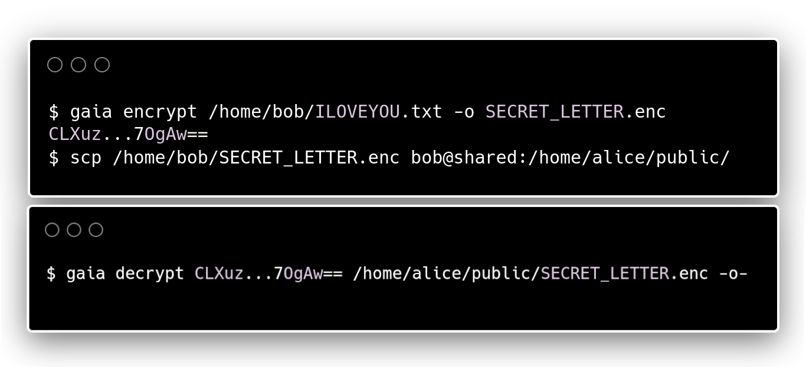

# Gaia

Gaia is a command-line application and library for encrypting and decrypting files.


<br clear="both"/>

## Compiling the CLI

1. [Install Rust](https://rustup.rs/)
2. ```shell
   $ git clone https://github.com/bluelhf/gaia
   $ cargo build --release
   ```
3. The compiled binary is at `target/release/gaia`.

## Usage as a library
See the command-line interface code in this repository for an example on how to depend on and use the library :)

## Implementation

Gaia encrypts data with a STREAM-LE31 AES-256-GCM-SIV construction.

These use the STREAM-LE31 construction with AES-256-GCM-SIV, as implemented in [aead::stream](https://docs.rs/aead/latest/aead/stream/index.html).

Handles can be converted to and from URL-safe BASE64 strings when the `base64` library is enabled by using another pair of methods:

1. `gaia::keystore::to_secret((Key, Nonce)) -> Result<String, ...>`
2. `gaia::keystore::from_secret(&str) -> Result<(Key, Nonce), ...>`

These simply concatenate the key and nonce and encode the result with [BASE64_URL_SAFE](https://docs.rs/base64/0.21.5/base64/engine/general_purpose/constant.URL_SAFE.html).

## Usage with Pithos

Gaia's GitHub repository comes with a POSIX shell
script for automatically encrypting a file with Gaia
and sending it to [Pithos](https://github.com/bluelhf/pithos).

```shell
$ /tmp/gaia/pithos upload <"Cargo.toml"
######################################################################## 100.0%
/tmp/gaia/pithos download CLXuz...7OgAw== 704bb29d-bbc0-455d-88e0-d0b96e25319e
```
```shell
$ /tmp/gaia/pithos download CLXuz...7OgAw== 704bb29d-bbc0-455d-88e0-d0b96e25319e
[package]
name = "gaia"
vers...
```
